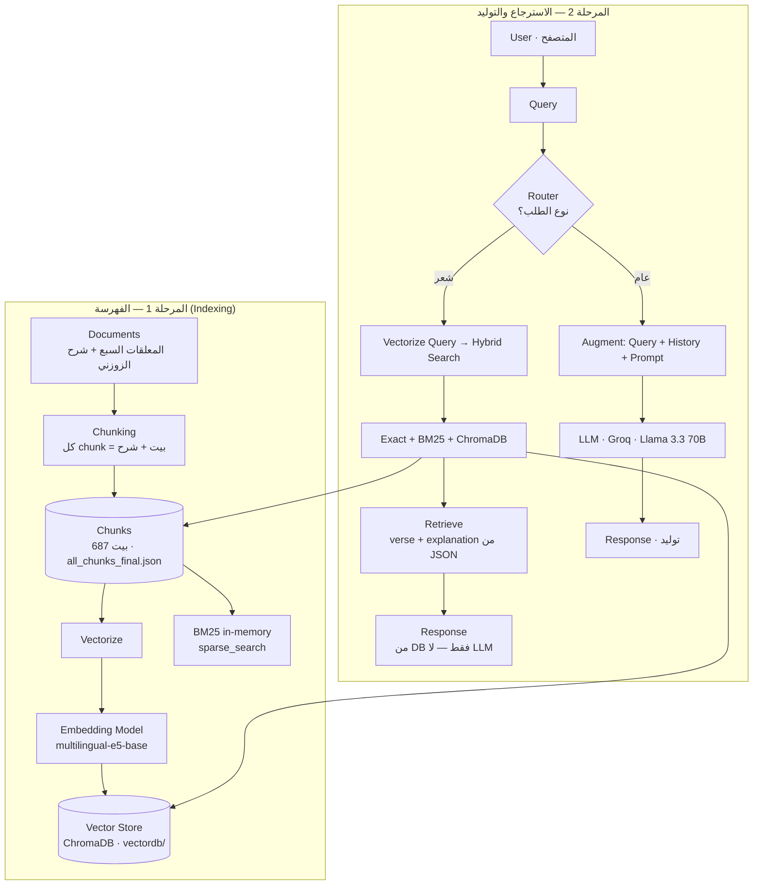
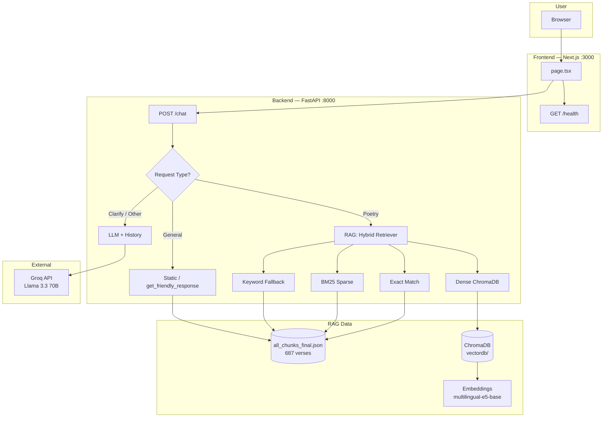

# Tarjuman — System Architecture

Smart assistant for classical Arabic poetry (Seven Mu'allaqat). Architecture document for the full system, RAG pipeline, and tech stack.

**Draw.io diagrams:** [docs/architecture.drawio](docs/architecture.drawio) — open in [app.diagrams.net](https://app.diagrams.net) or VS Code (Draw.io Integration). Three pages: **Tarjuman Architecture** (overview), **RAG Two Phases — ترجمان** (الفهرسة + الاسترجاع والتوليد), **RAG Flow — Keywords** (مخطط كلمات مفتاحية: Data → ChromaDB/BM25، User Query → Router → Hybrid Search → Matched Context → Verse from DB / LLM → Answer).

---

## 1. System Overview

```
┌─────────────────────────────────────────────────────────────────────────────┐
│  User (Browser)                                                              │
└─────────────────────────────────────────────────────────────────────────────┘
                                      │ HTTP/JSON
                                      ▼
┌─────────────────────────────────────────────────────────────────────────────┐
│  Frontend — Next.js 14 (Port 3000)                                           │
│  page.tsx · Chat UI · Health check · Examples · localStorage                 │
└─────────────────────────────────────────────────────────────────────────────┘
                                      │ POST /chat · GET /health
                                      ▼
┌─────────────────────────────────────────────────────────────────────────────┐
│  Backend — FastAPI (Port 8000) · api/main.py                                │
│  Chat Router → Poetry (RAG) | Static replies | LLM (Groq)                    │
└─────────────────────────────────────────────────────────────────────────────┘
                    │                    │                    │
        ┌───────────┴───────────┐        │                    │
        ▼                       ▼        ▼                    ▼
┌───────────────┐     ┌──────────────────────┐     ┌──────────────────────┐
│  RAG Layer   │     │  Static / Poet info  │     │  Groq API (LLM)       │
│  Hybrid      │     │  get_friendly_response│     │  Llama 3.3 70B        │
│  Retriever   │     │  from JSON / in-memory │     │  General Q&A          │
└───────┬───────┘     └──────────────────────┘     └──────────────────────┘
        │
   ┌────┴────┐
   ▼         ▼
┌──────┐  ┌────────────┐
│ JSON │  │ ChromaDB   │
│ 687  │  │ embeddings │
│ BM25 │  │ e5-base    │
└──────┘  └────────────┘
```

---

## 2. RAG Architecture — مرحلتان (مبنية على مشروع ترجمان)

المخطط التالي يطابق بنية RAG الكلاسيكية: **مرحلة الفهرسة** (تحضير البيانات) و**مرحلة الاسترجاع والتوليد** (الإجابة على المستخدم)، مُطبّقة على ترجمان.

### 2.0 المرحلة الأولى: الفهرسة (Indexing)

```
  ┌─────────────────────────────────────────────────────────────────────────────────────────┐
  │  Documents (المصادر)                                                                     │
  │  المعلقات السبع + شرح الزوزني — النص الأصلي قبل التقطيع                                  │
  └─────────────────────────────────────────────────────────────────────────────────────────┘
                                            │
                                            ▼
  ┌─────────────────────────────────────────────────────────────────────────────────────────┐
  │  Chunking (التقطيع)                                                                      │
  │  كل chunk = بيت شعر + شرحه (محفوظ في all_chunks_final.json)                              │
  └─────────────────────────────────────────────────────────────────────────────────────────┘
                                            │
                                            ▼
  ┌─────────────────────────────────────────────────────────────────────────────────────────┐
  │  Chunks (القصاصات) — 687 بيت + شرح                                                       │
  │  verse_text, explanation, poet, poem, source                                              │
  └─────────────────────────────────────────────────────────────────────────────────────────┘
                    │                                                          │
                    │ BM25 index (sparse)                                      │ Vectorize
                    ▼                                                          ▼
  ┌──────────────────────────────┐    ┌─────────────────────────────────────────────────────┐
  │  BM25 (in-memory)            │    │  Embedding Model — multilingual-e5-base             │
  │  rank_bm25 · sparse_search   │    │  LangChain HuggingFaceEmbeddings (embeddings.py)     │
  └──────────────────────────────┘    └─────────────────────────────────────────────────────┘
                                                          │
                                                          ▼
                                            ┌─────────────────────────────────────────────────┐
                                            │  Vector Store — ChromaDB (data/vectordb/)       │
                                            │  تخزين المتجهات للبحث الدلالي                   │
                                            └─────────────────────────────────────────────────┘
```

### 2.0 المرحلة الثانية: الاسترجاع والتوليد (Retrieval & Generation)

مساران حسب نوع الطلب:

**أ) مسار الشعر (RAG — بدون LLM للمحتوى):**

```
  User (المتصفح)  →  Query (بيت أو سؤال عن بيت)
       │
       ▼
  Frontend (Next.js)  →  POST /chat
       │
       ▼
  Backend Router  →  نوع الطلب = شعر (آية/شرح)
       │
       ▼
  Embedding Model  →  Vectorize Query (نفس multilingual-e5-base)
       │
       ▼
  Search  →  Hybrid: Exact Match → BM25 + ChromaDB (Dense)  →  merge & re-rank
       │
       ▼
  Retrieve  →  Relevant Contexts = verse + explanation من all_chunks_final.json
       │
       ▼
  Response  ←  إرجاع البيت + الشرح من DB مباشرة (لا LLM لمحتوى الآية)
```

**ب) مسار العام (سؤال عام / تحية / توضيح):**

```
  User  →  Query (من أنت، كيف حالك، وضح أكثر، إلخ)
       │
       ▼
  Router  →  نوع الطلب = عام
       │
       ▼
  Augment  →  Query + History (آخر 10 رسائل) + System Prompt
       │
       ▼
  LLM (Groq — Llama 3.3 70B)  →  Generate
       │
       ▼
  Response  →  إجابة توليدية (عربي فصيح، بدون ذكر شعراء من خارج المعلقات)
```

### 2.0 مخطط Mermaid — RAG بمرحلتين (ترجمان)



---

## 3. RAG Pipeline (Retrieval-Augmented Generation)

Tarjuman uses **RAG** for poetry: retrieve the relevant verse from the corpus, then return the **stored explanation** (Al-Zawzani) — no LLM generation for verse content.

### 3.1 RAG Flow (Poetry Query)

| Step | Component | Description |
|------|-----------|-------------|
| 1 | **Query** | User sends a verse or phrase (e.g. "قفا نبك من ذكرى حبيب ومنزل"). |
| 2 | **Router** | `api/main.py` decides: static (المعلقات, poet) / general (LLM) / **poetry** (RAG). |
| 3 | **Retrieve** | **Hybrid Retriever** (`src/retrieval/hybrid_search.py`): exact match → **Sparse (BM25)** + **Dense (ChromaDB)** → merge & re-rank. |
| 4 | **Fallback** | If no good hit: keyword search over `AppState.chunks` (`_find_verse_in_chunks_by_keywords`). |
| 5 | **Response** | Return verse + **explanation from DB** (no LLM). `enhance_explanation()` only cleans the text. |

### 3.2 RAG Components

| Component | Role | Tech |
|-----------|------|------|
| **Embeddings** | Turn text into vectors for semantic search | `multilingual-e5-base` (HuggingFace), LangChain `HuggingFaceEmbeddings` |
| **ChromaDB** | Store and search verse embeddings | `langchain_community.vectorstores.Chroma`, `data/vectordb/` |
| **BM25** | Keyword (sparse) search over verse text | `rank_bm25`, in-memory index from JSON |
| **Hybrid Retriever** | Combine exact match + BM25 + Dense; merge & re-rank | `src/retrieval/hybrid_search.py` |
| **Source of truth** | Verse text and explanation | `data/processed/all_chunks_final.json` (687 verses, Al-Zawzani) |

### 3.3 Where LLM Is Used (Not for Verse Content)

- **General Q&A:** greetings, "من أنت", "كيف حالك", "وضح اكثر", questions about poets/Mu'allaqat, etc. → first **retrieve context** from documents (Retriever, k=3), then `get_llm_response_with_history(..., context_hint=retrieved_context)` (LangChain + Groq). If no context in docs, LLM still answers from its knowledge (RAG with optional fallback).
- **No verse found (verse path):** **static message only** — `VERSE_NOT_IN_MUALLAQAT_MSG`. No LLM, no web search. The system does not search for or generate explanations for verses outside the Mu'allaqat.
- **Verse content:** never generated by LLM; always from JSON + `enhance_explanation()`.

---

## 4. Request Flow — `/chat`

1. **Request**  
   Frontend sends `POST /chat` with `{ query, history }`.

2. **Routing (api/main.py)**  
   - Explain without verse → "أعطني بيتاً..."  
   - المعلقات in query → static list (المعلقات السبع).  
   - غادر + متردم / غادر + الشعراء → direct search in `AppState.chunks` → verse card (عنترة).  
   - **is_general_question** → retrieve context from documents (optional), then `get_friendly_response` or LLM with history + `context_hint`.  
   - **Else** → **poetry (RAG)**.

3. **Poetry (RAG) path**  
   - Hybrid Retriever: exact match → sparse (BM25) + dense (ChromaDB) → merge & re-rank.  
   - Special cases (e.g. غادر/متردم): pick from results or chunks.  
   - Keyword fallback: `_find_verse_in_chunks_by_keywords(query, chunks)`.  
   - Response: `type: "poetry"`, `result: SearchResultItem` (verse_text, explanation from DB, poet, poem, source).

4. **No verse found (verse path)**  
   **Static message only** (`VERSE_NOT_IN_MUALLAQAT_MSG`): "هذا البيت ليس من المعلقات السبع. أنا أبحث فقط في المعلقات السبع." No LLM, no web search.

5. **General questions**  
   Retrieve context from documents (Retriever, k=3); pass to `get_llm_response_with_history(..., context_hint=retrieved_context)`. If no context, LLM answers from its knowledge (fallback to generation).

---

## 5. Components

| Component | Location | Role |
|----------|----------|------|
| **Frontend** | `tarjuman-ui/src/app/page.tsx` | Chat UI, examples, health check, localStorage. |
| **API** | `api/main.py` | FastAPI, `/chat`, `/search`, `/health`, `/poets`, `/examples`, router, RAG entry. |
| **Hybrid Retriever** | `src/retrieval/hybrid_search.py` | Exact → BM25 + ChromaDB → merge & re-rank. |
| **Sparse (BM25)** | `src/retrieval/sparse_search.py` | BM25Okapi, exact_match, over verse_text + text. |
| **Dense** | `src/retrieval/dense_search.py` | ChromaDB + embeddings (LangChain). |
| **Embeddings** | `src/retrieval/embeddings.py` | multilingual-e5-base, LangChain HuggingFaceEmbeddings. |
| **Chunks** | `data/processed/all_chunks_final.json` | 687 verses (verse_text, explanation, poet, poem, source). |
| **Vector DB** | `data/vectordb/` | ChromaDB persistence. |
| **LLM** | LangChain + Groq | Llama 3.3 70B for general Q&A only. |

---

## 6. Tech Stack

| Layer | Tech |
|-------|------|
| **Frontend** | Next.js 14, TypeScript, TailwindCSS, React Markdown |
| **Backend** | FastAPI, Python 3.9+ |
| **RAG** | Hybrid retrieval (exact + BM25 + vector), pure DB explanation |
| **Embeddings** | multilingual-e5-base (HuggingFace), LangChain HuggingFaceEmbeddings |
| **Vector store** | ChromaDB (LangChain community) |
| **Sparse search** | BM25Okapi (rank_bm25) |
| **LLM** | Groq API — Llama 3.3 70B (LangChain ChatGroq), optional |
| **Data** | JSON (687 verses), ChromaDB index |

---

## 7. Mermaid — Full System + RAG



---

## 8. Project Structure

```
Tarjuman/
├── api/
│   └── main.py                 # FastAPI, /chat, /search, /health, router, RAG entry
├── src/retrieval/
│   ├── hybrid_search.py        # HybridRetriever, exact + BM25 + Dense, merge
│   ├── sparse_search.py        # BM25, exact_match
│   ├── dense_search.py         # ChromaDB, LangChain vectorstore
│   └── embeddings.py           # multilingual-e5-base, LangChain HuggingFaceEmbeddings
├── data/
│   ├── processed/
│   │   └── all_chunks_final.json   # 687 verses (source of truth)
│   └── vectordb/                   # ChromaDB
├── tarjuman-ui/src/app/
│   └── page.tsx                # Chat UI
├── ARCHITECTURE.md              # This file
├── docs/
│   └── architecture.drawio     # Draw.io diagram
└── requirements.txt            # LangChain, ChromaDB, BM25, etc.
```

---

## 9. Summary

- **System:** User → Frontend (Next.js) → Backend (FastAPI) → RAG or Static or LLM.
- **Verse path:** Search only in documents (Mu'allaqat). If verse **not found** → **static message only** (`VERSE_NOT_IN_MUALLAQAT_MSG`); no LLM, no web search. Verse content is never generated; always from DB.
- **General path:** Retrieve context from documents (Retriever, k=3), then LLM answers with `context_hint`. If no context in docs, LLM still answers (fallback to generation).
- **RAG:** Query → Router → Hybrid Retriever (Exact + BM25 + ChromaDB) → merge & re-rank → verse + explanation from DB (no LLM for verse content).
- **Embeddings & LangChain:** Embeddings (multilingual-e5-base), ChromaDB (LangChain), LLM (LangChain + Groq) for general Q&A with optional retrieved context.
- **Data:** 687 verses in JSON; ChromaDB for vectors; BM25 in-memory.

For setup and usage, see [README.md](README.md).
